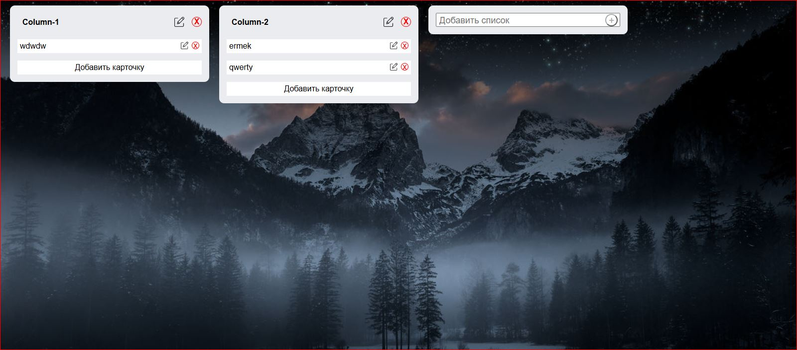

# Trello Clone React App

Простой Trello-подобный менеджер задач, реализованный на React с использованием Drag & Drop. Позволяет создавать колонки, добавлять и редактировать задачи, а также менять их порядок.  

Превью проекта:  

  

## ⚡ Основные возможности

- Добавление и удаление колонок.  
- Добавление, редактирование и удаление задач.  
- Перетаскивание задач внутри колонок и между ними.  
- Изменение порядка колонок через Drag & Drop.  
- Inline-редактирование названий колонок и задач.  

---

## 🛠 Технологии

- React + Hooks (useState)  
- SCSS  
- HTML5 Drag & Drop API  

Ссылка на демо: [Netlify](https://silly-raindrop-2f5dbd.netlify.app/)
